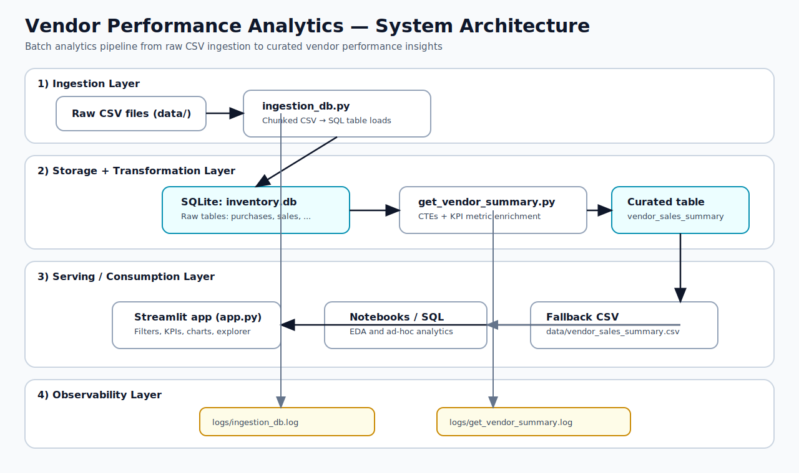
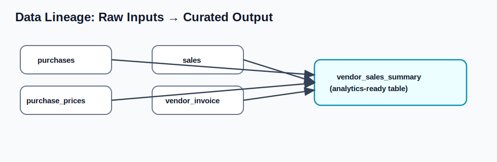
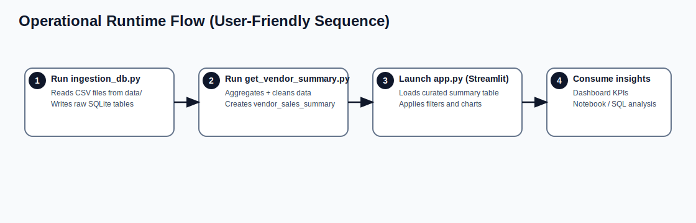

# System Design & System Architecture

## 1) Overview

This project implements a local-first analytics platform for vendor performance. It ingests raw CSV extracts, stores them in SQLite, transforms them into a curated analytics table, and exposes the result through notebooks and a Streamlit dashboard.

**Primary objective:** provide a reproducible and low-ops pipeline for procurement and sales analytics with minimal infrastructure.

---

## Visual Architecture Diagram

---

## 2) Architecture Style

The current design is a **layered batch analytics architecture**:

1. **Data Ingestion Layer** (`ingestion_db.py`)
2. **Transformation & Metrics Layer** (`get_vendor_summary.py`)
3. **Serving / Consumption Layer** (`app.py`, notebooks, ad-hoc SQL)
4. **Storage Layer** (`inventory.db` + optional fallback CSV)
5. **Observability Layer** (`logs/*.log`)

This is effectively a lightweight ELT/ETL hybrid:
- Extract/load raw tables first.
- Transform into `vendor_sales_summary` as a second step.

---

## 3) High-Level System Context

> Note: This document uses static SVG diagrams (instead of Mermaid blocks) so they render consistently across Markdown viewers.

At a glance:
1. Raw CSV files are ingested into SQLite raw tables.
2. Transformation logic builds a curated summary table.
3. The dashboard and notebooks consume curated analytics.
4. Logging captures ingestion and transformation execution details.

---

## 4) Component Design

## 4.1 Ingestion Component (`ingestion_db.py`)

### Responsibilities
- Scan `data/` for CSV files.
- Normalize filename to table name (`build_table_name`).
- Read files in chunks for memory-safe processing (`iter_csv_chunks`).
- Persist each chunk to SQLite with correct write mode (`replace` first chunk, then `append`).

### Inputs
- CSV files under `data/`.

### Outputs
- Raw SQLite tables in `inventory.db`.
- Operational logs in `logs/ingestion_db.log`.

### Design Characteristics
- **Memory-aware:** chunked reads (`chunksize=100000` default).
- **Idempotent per file refresh:** first chunk replaces table.
- **SQLite-safe inserts:** enforces batch limits vs SQLite variable caps.

---

## 4.2 Transformation Component (`get_vendor_summary.py`)

### Responsibilities
- Validate required raw tables exist.
- Execute SQL CTE pipeline to aggregate purchases, sales, and freight.
- Clean data and compute derived KPIs.
- Persist canonical curated table `vendor_sales_summary`.

### Inputs
- Raw tables: `purchases`, `purchase_prices`, `sales`, `vendor_invoice`.

### Outputs
- Curated table: `vendor_sales_summary` in `inventory.db`.
- Operational logs in `logs/get_vendor_summary.log`.

### KPI Formulas
- `GrossProfit = TotalSalesDollars - TotalPurchaseDollars`
- `ProfitMargin = GrossProfit / TotalSalesDollars * 100`
- `StockTurnover = TotalSalesQuantity / TotalPurchaseQuantity`
- `SalesToPurchaseRatio = TotalSalesDollars / TotalPurchaseDollars`

All ratios are denominator-protected to avoid division-by-zero failures.

---

## 4.3 Serving Component (`app.py`)

### Responsibilities
- Load `vendor_sales_summary` from SQLite.
- Provide fallback to `data/vendor_sales_summary.csv` for lightweight/cloud mode.
- Offer filters and interactive visualizations.
- Allow one-click refresh path (ingest + rebuild summary) when raw tables are missing.

### UI Domains
- KPI cards (sales, gross profit, purchase spend, average margin)
- Overview visualizations (top vendors, brand mix, profitability views)
- Vendor explorer and data table

---

## 5) Data Architecture

## 5.1 Storage
- **Primary datastore:** SQLite (`inventory.db`)
- **Raw zone:** one table per CSV file
- **Curated zone:** `vendor_sales_summary`
- **Fallback artifact:** `data/vendor_sales_summary.csv`

## 5.2 Table Lineage

The curated table is derived from:
- `purchases`
- `purchase_prices`
- `sales`
- `vendor_invoice`

## 5.3 Granularity
- Curated table grain is effectively **vendor + brand** (with vendor-level freight joined).

---

## 6) End-to-End Runtime Flow

Step-by-step flow:
1. Run `ingestion_db.py` to load raw CSV data.
2. Run `get_vendor_summary.py` to generate `vendor_sales_summary`.
3. Launch `app.py` (Streamlit) to visualize KPIs and trends.
4. Explore outputs in the dashboard and notebooks.

---

## 7) Non-Functional Design

## 7.1 Reliability
- Defensive checks for missing required raw tables.
- Logging for ingestion and transformation failures.
- Ratio calculations protected against zero denominators.

## 7.2 Performance
- Chunked CSV ingestion limits memory spikes.
- Heavy grouping done in SQL CTEs before pandas enrichment.
- Caching in Streamlit for repeated reads/aggregations.

## 7.3 Maintainability
- Clear separation between ingestion, transformation, and presentation modules.
- Named constants for table names and default paths.
- Re-runnable scripts with explicit `main()` entry points.

## 7.4 Scalability (Current Limits)
- SQLite is ideal for local/single-user workflows.
- As data volume and concurrency grow, bottlenecks likely in write contention and single-file DB throughput.

---

## 8) Deployment Model

## 8.1 Local Development (Primary)
- Install dependencies from `requirements.txt`.
- Run ingestion and summary scripts.
- Launch Streamlit app.

## 8.2 Lightweight Cloud Dashboard
- Skip full raw-data ingestion in cloud if files are too large.
- Publish only curated `data/vendor_sales_summary.csv` as fallback source.

---

## 9) Security & Data Governance Considerations

Current project is focused on local analytics and does not enforce role-based access controls. For production-hardening:
- Add input schema validation for CSVs.
- Add PII classification checks (if future data includes sensitive columns).
- Add checksum/version metadata for source file provenance.
- Add explicit data retention policy for raw extracts and logs.

---

## 10) Recommended Evolution Path

1. **Config externalization**: move DB path, chunk size, and required tables to config/CLI args.
2. **Data quality layer**: required-column checks, null threshold checks, metric sanity constraints.
3. **Automated tests**: unit tests for table naming, KPI calculations, and integration tests for pipeline run.
4. **Orchestration**: scheduled job (cron/GitHub Actions/Airflow) with run metadata.
5. **Warehouse migration option**: if scaling demands increase, migrate raw/curated layers to Postgres or DuckDB while keeping module boundaries stable.

---

## 11) Architecture Decision Summary (ADR-lite)

- **Decision:** Use SQLite for storage.
  - **Why:** zero-ops, fast local iteration, easy distribution.
- **Decision:** Use chunked pandas ingestion.
  - **Why:** large CSV support in constrained environments.
- **Decision:** Use SQL for core aggregation + pandas for KPI enrichment.
  - **Why:** balances query efficiency with Python flexibility.
- **Decision:** Keep dashboard coupled to curated table contract.
  - **Why:** minimizes UI complexity and keeps semantic layer centralized.

---

## 12) Operational Runbook (Quick)

1. Add CSVs to `data/`.
2. Run `python ingestion_db.py`.
3. Run `python get_vendor_summary.py`.
4. Start UI with `python -m streamlit run app.py`.
5. Inspect `logs/` for failures.

